# AI MEMORY / Mimir

[](https://github.com/Walc21/AI-MEMORY/actions/workflows/ci.yml)

[](https://github.com/Walc21/AI-MEMORY/releases/tag/v0.3.0)

**Memória local auditável: bytes → estrutura → evidências → afirmações temporais → consulta com fontes.**

A **v0.3.0 implementa o Semantic Core e Output Storage**, concluindo o fluxo executável do Mimir sobre a fundação da v0.2.0. O [manual de implementação](docs/reference/semantic-core-manual.pdf) orienta os contratos, o histórico, a recuperação híbrida e os adaptadores multimodais. O ledger preserva as fontes; índices e resumos são derivações verificáveis.

```mermaid
flowchart LR
    I[Input / Pacote] --> N[Namer / BBN1_1]
    N --> H[Hot Hub: bytes]
    H --> T[Route Hub / protocolos]
    T --> C[Frankenstein / Curadoria]
    C --> GP[G_P: estrutura e origem]
    GP --> B[BN1_2 verificado]
    B --> E[EvidenceAnchor / G_M]
    E --> S[Semantic Core / G_S]
    S --> R[Busca híbrida / contexto]
    R --> O[Output Storage / resposta citada]
```



## Comece agora

Requer **Python 3.10+ e POSIX/Linux**, com SQLite FTS5. O núcleo funciona offline, sem chave de API ou serviço externo.

```bash
git clone https://github.com/Walc21/AI-MEMORY.git
cd AI-MEMORY
python -m venv .venv
source .venv/bin/activate
python -m pip install .

mimir episode 'João trabalha na OpenAI em 2023.'
mimir query 'Onde João trabalha?' --text
mimir verify
```

Resposta: `Segundo a fonte: João trabalha na OpenAI em 2023.`, acompanhada da referência à fonte. Sem `--text`, a consulta retorna JSON com evidências, afirmações, tempos, plano de busca e contexto. Todos os comandos também aceitam `python -m mimir`.

Para ingerir arquivos e salvar uma consulta:

```bash
mimir --runtime /tmp/mimir-lote-1 run /caminho/notas.txt /caminho/dados.json \
  --query 'Onde João trabalha?'
mimir query 'Onde João trabalha?' --save
```

Cada `run` usa um **diretório de ciclo novo**. Lotes distintos entram no mesmo ledger, mantendo seus históricos. A memória padrão fica em `.mimir-memory/default`; use `--memory-dir /caminho/memoria --namespace projeto` antes do comando para escolher outra. `MIMIR_MEMORY_DIR`, `MIMIR_NAMESPACE` e `MIMIR_RUNTIME_DIR` configuram os padrões.

Para avançar um ciclo já construído na v0.2.0:

```bash
mimir --runtime /caminho/do/ciclo semantic
mimir verify
```

O Semantic Core verifica e consome o BN1_2 existente. Os contratos `mimir.byte-chunks.v1`, `mimir.structural.v1`, `mimir.bn1_2.v1`, o layout 3 e os comandos `python -m input` continuam compatíveis. Sem BN1_2, a ingestão e transformação são concluídas automaticamente.

## Memória e consulta

| Comando | Uso |
| --- | --- |
| `run ARQUIVOS... [--query PERGUNTA]` | Executa o pipeline completo; a consulta opcional salva a saída. |
| `semantic [--force]` | Consome BN1_2; reutiliza a geração do mesmo perfil ou acrescenta nova inferência. |
| `query PERGUNTA [--text] [--save]` | Combina BM25, vetores, entidades, tempo, RRF e PageRank personalizado. |
| `query PERGUNTA --at 2020` | Consulta o tempo de validade de uma informação. |
| `query PERGUNTA --as-of TIMESTAMP` | Consulta o que já estava registrado naquele instante, com fuso ISO 8601. |
| `query PERGUNTA --history [--audit]` | Inclui afirmações substituídas; `--audit` permite recuperar passagens inativas. |
| `inspect [COLEÇÃO]` | Lista assertions, mentions, entities, inference_runs, episodes, reflections etc. |
| `explain ASSERTION_ID` | Percorre afirmação → inferência → evidência → origem e bytes. |
| `export-source CONTENT_ID DESTINO` | Exporta os bytes canônicos para um arquivo novo. |
| `update NOVA_ASSERTION ANTIGA_ASSERTION` | Acrescenta supersession; `--relation retracts` registra retratação. |
| `resolve MENTION_ID 'Nome' --type person` | Registra uma resolução humana reversível da entidade. |
| `episode TEXTO [--type interaction]` | Preserva interações como fontes e episódios persistentes. |
| `working --json '{"objective":"..."}'` | Configura identidade, objetivo, projeto, restrições e compromissos. |
| `consolidate [--type reflective]` | Cria resumos hierárquicos; tipos procedural e community disponíveis. |
| `reindex` | Reconstrói as projeções sem alterar a memória canônica. |
| `gc [--apply]` | Lista/remove tentativas órfãs e índices; preserva a cadeia canônica e os bytes. |
| `verify` | Verifica gerações, histórico, hashes, grafos, inferências, spans e fontes. |
| `eval [--dataset ARQUIVO.json]` | Executa avaliações locais e adaptadores LongMemEval/LoCoMo. |

Assertions registram **o que a fonte relata**, com polaridade, `valid_time` e `transaction_time`. Conflitos permanecem visíveis; atualizações acrescentam relações, sem apagar afirmações anteriores. A resolução automática usa nomes normalizados exatos como candidatos. Aliases ambíguos requerem resolução explícita.

A extração padrão reconhece padrões fechados em português e inglês: trabalho/entrada em organização, residência, nascimento, responsabilidade e descrições com “é/is”, incluindo negação e datas explícitas. Texto fora desses padrões permanece pesquisável como evidência. As respostas padrão citam as fontes ou se abstêm; a extração geral de linguagem natural depende de um modelo opcional.

A busca vetorial padrão usa **feature hashing de palavras e trigramas**, que mede semelhança lexical. Embeddings neurais são opcionais. As projeções SQLite são reconstruídas automaticamente quando ausentes ou corrompidas. Consultas trabalham com o ledger local inteiro; corpora muito grandes exigem dimensionamento e um índice vetorial especializado.

## Formatos e modelos opcionais

Texto UTF-8, JSON, CSV/TSV, DOCX, XLSX e WAV PCM usam a biblioteca padrão. Para PDF, imagens e outros arquivos de áudio/vídeo:

```bash
python -m pip install '.[structural]'
mimir --runtime /tmp/mimir-multimodal run documento.pdf imagem.png audio.wav video.mkv
```

Os protocolos preservam texto, localização, sequência, streams, frames e mídia embutida. DOCX cobre o corpo principal; PDF cobre páginas e imagens XObject diretas. A cobertura de leitura consta nos relatórios. Arquivos opacos conservam seus bytes e motivo de falha, sem inventar conteúdo. Consulte o [contrato estrutural](docs/structural-pipeline.md).

**OCR:** instale Tesseract e os idiomas no sistema, além das dependências Python:

```bash
# Debian/Ubuntu
sudo apt-get install tesseract-ocr tesseract-ocr-eng tesseract-ocr-por
python -m pip install '.[ocr]'
mimir --runtime /tmp/mimir-ocr run imagem.png digitalizado.pdf \
  --ocr --ocr-language por+eng --strict-multimodal
```

OCR registra linhas, caixas em pixels e confiança. **ASR:** instale `pip install '.[asr]'` e forneça um diretório já baixado de modelo compatível com faster-whisper usando `--asr-model /caminho/modelo`. A transcrição usa CPU/int8 e registra intervalos de tempo/amostras no PCM reamostrado a 16 kHz. Os pesos são identificados por hash; o comando não baixa modelos.

**Extração por LLM e visão:** instale e execute Ollama localmente, preparando os modelos escolhidos no próprio Ollama:

```bash
mimir --runtime /tmp/mimir-llm run notas.txt --extractor ollama --model SEU_MODELO
mimir --runtime /tmp/mimir-visao run imagem.png video.mkv \
  --vision-model SEU_MODELO_DE_VISAO --video-stride 30
```

O endpoint padrão é `http://127.0.0.1:11434`; somente endpoints HTTP de loopback são aceitos. A revisão do modelo e o prompt entram no perfil. A saída do extractor passa por validação de JSON, entidades, datas, quotes e offsets; uma evidência inventada impede a publicação. Descrições visuais e transcrições são observações derivadas, identificadas nas citações, e não alteram G_P. Vídeo aplica OCR/visão em um frame a cada `--video-stride` frames observados.

**Embeddings neurais:** instale `pip install '.[vectors]'`, prepare um modelo SentenceTransformers local e use `query ... --embedding-model /caminho/modelo` ou `reindex --embedding-model /caminho/modelo`. Um identificador de modelo em cache exige `--embedding-revision` imutável de 40 caracteres. O carregamento é offline. Cada perfil tem seu próprio índice; mudar embeddings não modifica o ledger.

Modelos de ASR, visão, extração geral e embeddings neurais não são distribuídos neste repositório. Sem uma modalidade disponível, seu erro é registrado; `--strict-multimodal` impede a publicação daquele lote. OCR real é testado; ASR e os modelos Ollama têm testes de contrato com fixtures locais, sem alegação de qualidade de modelos não executados.

## Persistência, auditoria e proteção

```text
.mimir-memory/<namespace>/
  policy.json                     # ACL POSIX / chave pública confiável
  manifest.json                   # geração ativa, com publicação atômica
  sources/<sha256>.bin             # bytes originais endereçados por conteúdo
  generations/<id>/               # ledger completo, manifesto, G_M e G_S
  indexes/<generation>/<profile>/  # SQLite FTS5, vetores, entidades, tempo e grafo
  working.json                    # configuração de memória de trabalho
  Output_Storage/output.json      # resposta citada ligada à geração/fingerprint
```

`content_id` identifica bytes iguais entre ciclos. `EvidenceAnchor` mantém identidade por conteúdo/localizador/protocolo; bindings conservam cada ocorrência histórica e seu `source.id`. Os originais e snapshots estruturais são arquivados na memória: episódios continuam verificáveis após a remoção de seus runtimes temporários.

Namespaces têm ACL por UID POSIX (`policy --readers ... --writers ...`); permissões do sistema de arquivos também precisam permitir o acesso desejado. O processo local deve ser executado como usuário autorizado. Não há servidor público, autenticação web ou criptografia de disco incorporados. Use proteção e backup do sistema operacional para o diretório canônico.

Assinaturas opcionais:

```bash
python -m pip install '.[signing]'
mkdir -p .mimir-keys
mimir keygen .mimir-keys/memory.pem
mimir episode 'Alice works at Acme.' --signing-key .mimir-keys/memory.pem
```

Depois da primeira assinatura, novas gerações exigem a chave confiável. Operações `semantic`, `episode`, `update`, `resolve` e `consolidate` aceitam `--signing-key`. Proteja a chave privada e `policy.json`; hashes detectam corrupção, e Ed25519 autentica as gerações contra a chave pública fixada.

Parsers e extractors executam em processos separados com timeout, limites POSIX de CPU/memória/saída, bloqueio de execução arbitrária e escrita restrita ao temporário por auditoria Python. Rede é bloqueada, exceto loopback quando o modelo local foi escolhido. O limite padrão do worker é 60 s, 2 GiB e 64 MiB de saída; o lote semântico limita 2 milhões de caracteres, 20 mil assertions e 200 mil registros. A API aceita `SemanticLimits`.

Esse controle de processos **não é uma sandbox de kernel para código nativo**. Para documentos hostis em ambientes compartilhados, execute sob uma sandbox/container do sistema operacional. Conteúdo de documentos é tratado como dado, sem execução de instruções, scripts ou ferramentas. O Hot Hub continua no contrato v1 e reconstrói um arquivo inteiro por vez.

## API, demonstração e validação

```python
from pathlib import Path
from mimir import Memory

memory = Memory(Path(".mimir-memory"), namespace="projeto")
memory.episode("Alice works at Acme in 2020.")
result = memory.query("Where Alice works?", budget_chars=8000)
print(result["answer"])
print(memory.explain(result["claims"][0]["assertion_id"]))
```

```bash
python -m examples.semantic_memory
mimir eval
python -m pip install -r requirements.txt -r requirements-demo.txt '.[structural,ocr,signing]'
python -m unittest discover -s tests -v
python -S -m unittest discover -s tests -p 'test_semantic_core.py' -v
```

A CI verifica Python 3.10 e 3.12, o núcleo sem site-packages, OCR, assinaturas, instalação da CLI e regressões do pipeline anterior. O harness reporta cobertura de extração anotada, Recall@8, MRR, nDCG@8, categorias de tempo/multi-hop/atualização, conflito, abstention, resolubilidade da evidência, reconstrução de índices e latência. As métricas locais usam fixtures e correspondência de evidências; os adaptadores de LongMemEval/LoCoMo **não equivalem aos escores oficiais desses benchmarks**.

Os [contratos e mapa S0–S15](docs/semantic-core.md), [chunks](docs/byte-chunks.md), [pipeline estrutural](docs/structural-pipeline.md), [referência visual](docs/images/mimir-pipeline-2026-09-28.jpg) e [changelog](CHANGELOG.md) detalham a implementação.
