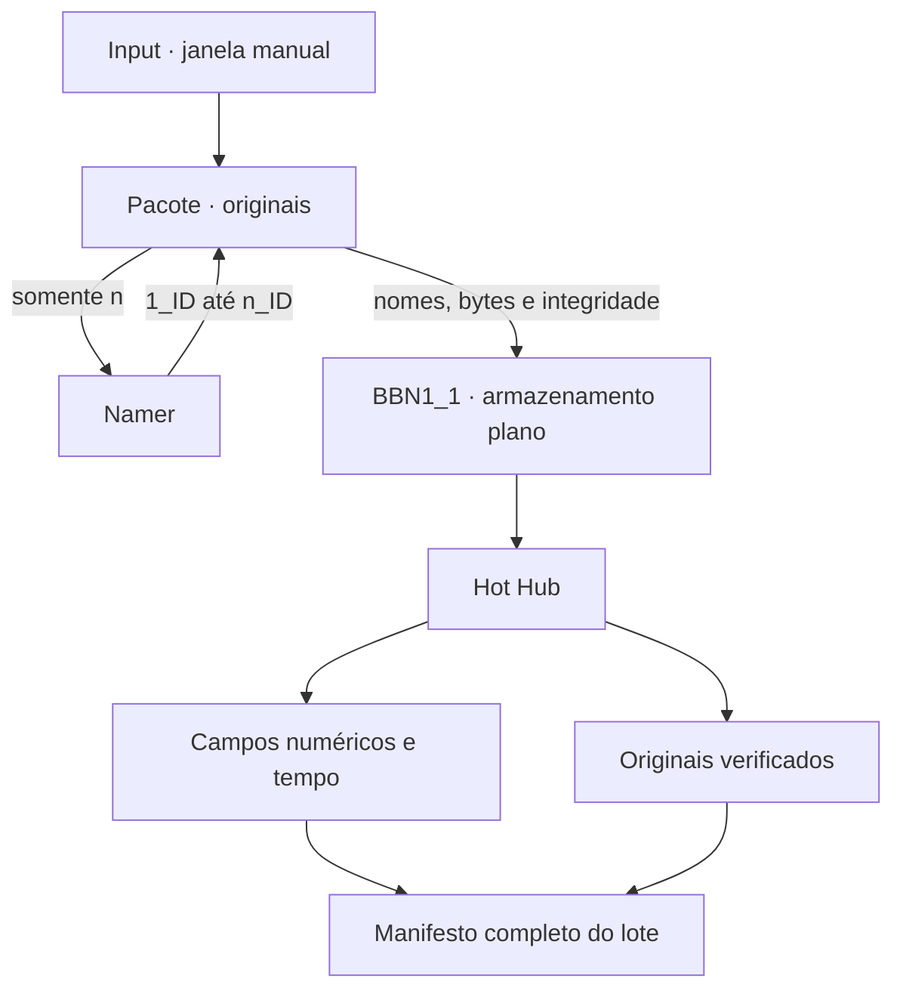

# AI MEMORY / Mimir

Ingestão local de arquivos com originais preservados e uma representação comum de **campos de valores, eixos e tempo**. O armazenamento não separa arquivos por extensão, formato ou modalidade. A entrada pública é `python -m input`.

O Hot Hub agora faz duas operações: mantém uma cópia verificada do lote e publica representações numéricas dos conteúdos que consegue decodificar. Um formato desconhecido permanece disponível como bytes, com estado explícito de **não modelado**. Não é apresentado como uma transformação concluída.

## Fluxo implementado



1. `open` abre a janela; `add` recebe arquivos regulares de qualquer formato. Cada envio é uma entrada, mesmo com bytes iguais.
2. `close` fecha a janela. O Pacote conta o lote e envia somente `n` ao Namer.
3. O Namer gera um ID de três caracteres alfanuméricos por lote e devolve os stems `1_ID` até `n_ID`. O Pacote associa os stems aos arquivos, salva a associação e renomeia. O sufixo original é preservado no nome, sem determinar o destino ou o decodificador.
4. O BBN1_1 recebe a lista diretamente do Pacote, requisita os bytes e verifica os hashes de nome e conteúdo. Todos os arquivos ficam na mesma pasta.
5. O Hot Hub recebe os originais, verifica o lote e gera campos numéricos a partir do conteúdo. Amostras, tempos, diferenças e proveniência são publicados em uma geração verificada.
6. O BBN1_1 libera suas cópias somente depois da publicação e da confirmação de dois conjuntos completos de originais: Pacote e Hot Hub.

**Sorter, IDD e partições por extensão foram removidos.** As fontes arquiteturais de 28/09/2026 descrevem a versão anterior; o [contrato de campos](docs/temporal-fields.md) registra a alteração e os limites da implementação atual.

## O que a representação faz

| Entrada | Representação implementada | Tempo |
| --- | --- | --- |
| Imagem estática reconhecida | Planos de amostras na resolução e profundidade fornecidas pelo decodificador; sem conversão automática para RGB de 8 bits | Campo constante no tempo; variação temporal zero |
| Áudio decodificável | Amostras e canais nativos, em blocos; diferenças entre amostras e entre blocos | Taxa de amostragem e timestamps nativos |
| Vídeo decodificável | Todos os quadros das trilhas suportadas; planos nativos e diferenças entre quadros | Timestamps racionais reais; não fixa 24 fps |
| Tensor NumPy numérico (`.npy`) | Eixos e dtype preservados, sem projetar os dados em três dimensões | Não presume que algum eixo seja tempo |
| Conteúdo não suportado, corrompido ou acima dos limites de derivação | Referência íntegra aos bytes originais e motivo de não modelagem | Não inventa um relógio |

O decodificador é escolhido por sondagem do conteúdo, sem classificação por extensão. A cobertura depende do FFmpeg incluído no PyAV e dos layouts numéricos suportados por este projeto. PDF, documentos, arquivos compactados, programas e outros conteúdos sem adaptador próprio permanecem como bytes não modelados; não são executados nem convertidos em imagens por suposição.

Um arquivo pode conter várias modalidades. Trilhas não modeladas aparecem no registro e tornam o resultado `partial`. Formatos de pixels não suportados ou falhas de decodificação deixam o resultado `opaque`, sem publicar uma sequência numérica truncada como se estivesse completa.

## Executar

Requer **Python 3.10+ em POSIX**, NumPy e PyAV. O PyAV normalmente fornece FFmpeg em seu wheel; não é necessário chamar o programa `ffmpeg` pela linha de comando.

```bash
python -m pip install -r requirements.txt
python -m input open
python -m input add /caminho/imagem.png /caminho/audio.wav /caminho/video.mkv
python -m input add /caminho/arquivo-sem-extensao
python -m input close
python -m input status
```

`close` informa quantos arquivos foram decodificados, parcialmente modelados ou mantidos como opacos. `HUB_READY` significa que o lote foi preservado e que todos os registros foram publicados; **não significa que todos os formatos foram decodificados**.

Uma nova chamada a `close` retoma uma execução interrompida sem gerar outro ID nem refazer o sorteio. Ela também verifica os originais e os derivados e pode reconstruir dados alterados a partir do Pacote íntegro. Cada diretório de execução aceita um ciclo; escolha outro `MIMIR_RUNTIME_DIR` para um lote independente.

## Dados e integridade

| Local no diretório de execução | Conteúdo |
| --- | --- |
| `cycle.json` | Estado do ciclo, associação dos nomes e resumo das representações |
| `BN1_1/Pacote/files/<entrada>/<nome>` | Primeiro conjunto de originais |
| `BN1_1/Namer/` | Mensagem contendo apenas `n` e resposta com os stems |
| `BN1_1/BBN1_1/<nome>` | Cópias intermediárias; removidas após confirmação |
| `Transformer_Core/Hot_Hub/data/<nome>` | Segundo conjunto de originais, em uma pasta plana |
| `Transformer_Core/Hot_Hub/manifest.json` | Inventário e SHA-256 dos originais |
| `Transformer_Core/Hot_Hub/representations/<geração>/<objeto>/` | Registro JSON e arrays `.npy`; divisão por identidade, nunca por formato |
| `Transformer_Core/Hot_Hub/fields.json` | Geração publicada, proveniência, inventário dos derivados e contagens |

O diretório padrão é `.mimir-runtime/`, ignorado pelo Git. JSON descreve os contratos; arquivos `.npy` armazenam arrays sem pickle. Os arquivos originais continuam sendo arquivos binários, preservados byte a byte. Não há necessidade de um banco SQL ou YAML de extensões.

A geração é publicada por último, após a gravação dos registros e arrays. Uma falha de escrita impede a conclusão e a limpeza do BBN1_1. Gerações anteriores ou órfãs de uma interrupção podem permanecer no armazenamento; somente a apontada por `fields.json` está ativa. Não existe coleta automática desses derivados nesta versão.

A garantia de preservação refere-se aos originais. Os campos retêm as amostras produzidas pelo decodificador, com metadados de precisão; não substituem todos os metadados, estruturas e comportamentos do arquivo original. Diferenças de inteiros de até 32 bits usam `int64`; diferenças e taxas em ponto flutuante estão sujeitas a arredondamento. Nenhuma interpretação visual, semântica ou trajetória é inferida automaticamente.

## Compatibilidade e limites

- O layout atual é a versão 2. Ciclos anteriores são recusados antes de alterar o estado ou os arquivos. Preserve-os e reenvie seus originais para outro `MIMIR_RUNTIME_DIR`; não há migração automática.
- Os limites padrão por arquivo são 32 milhões de elementos por array, 1 GiB de arrays derivados e 100 mil quadros/blocos por trilha. Ao atingir um limite, o arquivo fica opaco, com motivo registrado, e os originais são preservados. `FieldStore(..., limits=Limits(...))` permite ajustar esses valores pela API Python.
- Os limites controlam a publicação de derivados; não constituem um sandbox nem garantem um teto rígido de memória dentro dos decodificadores nativos. O processamento mantém um quadro/bloco e seu predecessor por campo, em vez de carregar o vídeo inteiro.
- Não há expiração automática do Pacote nem encerramento final do ciclo. A limpeza controlada do BBN1_1 conserva dois conjuntos íntegros; não é uma garantia contra falha simultânea do dispositivo físico.

## Verificação

```bash
python -m compileall -q input BN1_1 Transformer_Core tests
python -m unittest discover -s tests -v
```

A CI executa as regressões em Python 3.10 e 3.12. Os testes cobrem armazenamento plano, concorrência, identidade estável, recuperação, integridade, imagens RGB e cinza de 16 bits, áudio estéreo, vídeo com intervalos variáveis, múltiplas trilhas, gradientes, tensores, entradas opacas e publicação interrompida.

O [contrato técnico](docs/temporal-fields.md) explica a formulação matemática, as diferenças entre variação e movimento e como ler os resultados.
