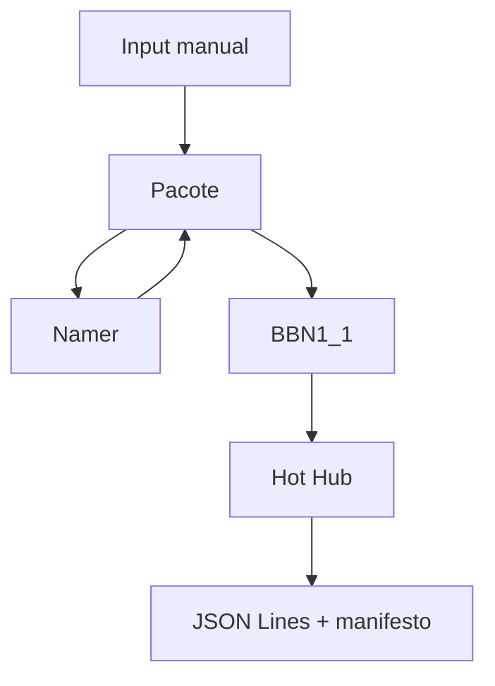
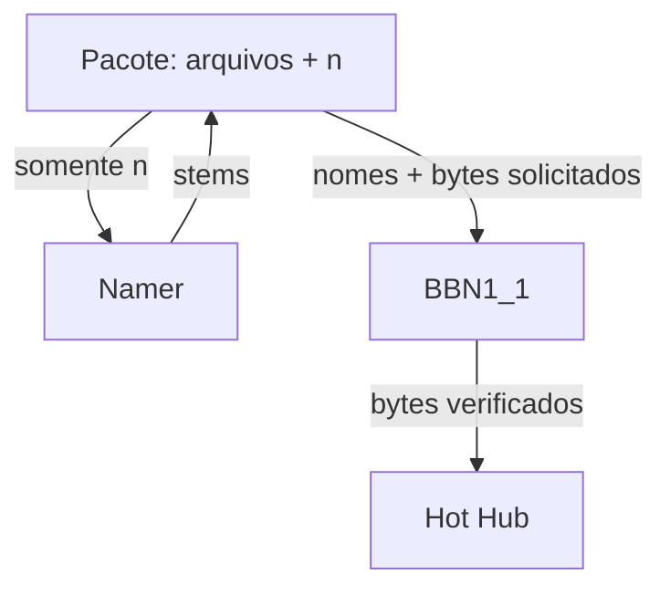
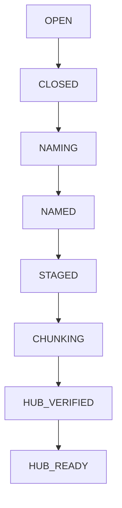
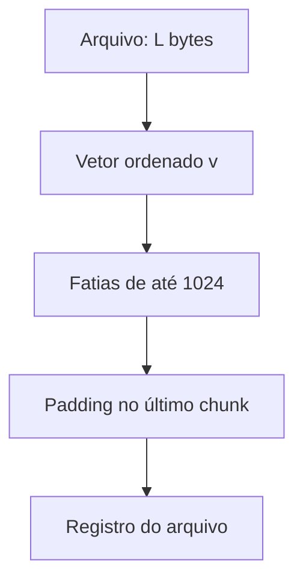
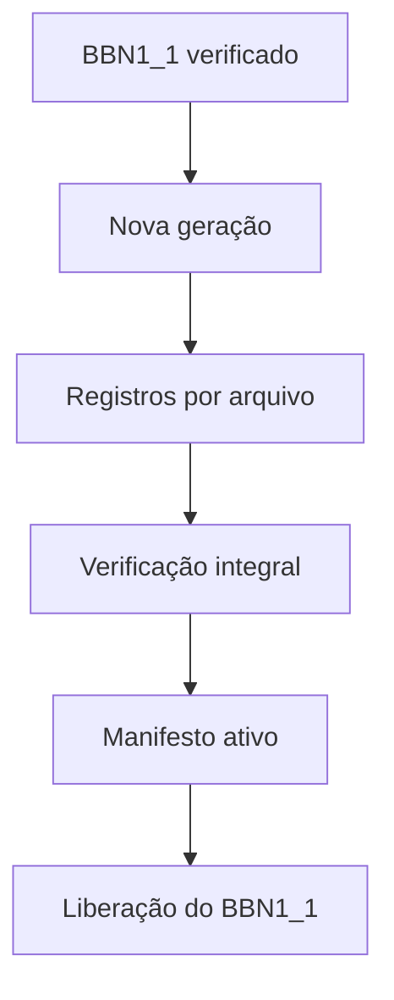
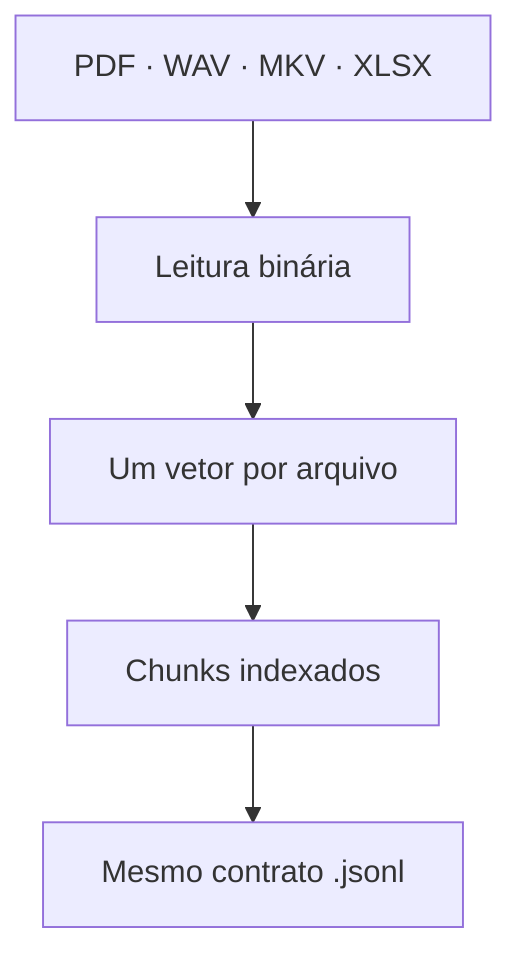

<div align="center">

# AI MEMORY / Mimir

### Ingestão verificável e representação única de arquivos como vetores de bytes

[](https://github.com/Walc21/AI-MEMORY/actions/workflows/ci.yml)


**Um arquivo entra com seus bytes intactos. Um vetor ordenado é dividido em chunks de 1024 componentes. Um registro verificável permite recuperar exatamente o arquivo.**

</div>

> **Estado implementado:** janela manual de Input, Pacote, Namer, BBN1_1 e Hot Hub. O pipeline publica registros JSON Lines (`.jsonl`) de chunks de bytes e um manifesto de geração. A interpretação do conteúdo e as demais etapas da arquitetura ampla do Mimir não fazem parte deste repositório neste estado.

## Sumário

- [Visão geral](#visão-geral)
- [Mapa da implementação](#mapa-da-implementação)
- [Ciclo de entrada e BN1_1](#ciclo-de-entrada-e-bn1_1)
- [O algoritmo do Hot Hub](#o-algoritmo-do-hot-hub)
- [Identidade e contrato JSON Lines](#identidade-e-contrato-json-lines)
- [Publicação, verificação e retomada](#publicação-verificação-e-retomada)
- [Quatro formatos, o mesmo procedimento](#quatro-formatos-o-mesmo-procedimento)
- [Executar e inspecionar](#executar-e-inspecionar)
- [Estrutura e limites atuais](#estrutura-e-limites-atuais)
- [Testes](#testes)

---

## Visão geral

O AI MEMORY parte da ideia de receber arquivos heterogêneos sem amarrar a entrada a um modelo ou a um único formato de documento. **A implementação presente é a camada inicial desse projeto:** ela recebe arquivos regulares locais, conserva uma cópia no Pacote, atribui nomes temporários, verifica os bytes em uma passagem intermediária e publica cada arquivo como uma sequência indexada de vetores de 1024 inteiros entre 0 e 255.

O Hot Hub **não abre um PDF como páginas, um WAV como amostras, um vídeo como frames ou uma planilha como células**. Ele lê os bytes completos de cada arquivo, inclusive cabeçalhos e metadados do contêiner. Por isso o mesmo código processa extensões conhecidas, desconhecidas ou até conteúdo que outro aplicativo consideraria inválido. O resultado transformado usa sempre `.jsonl`; os originais continuam preservados no Pacote.

| Propriedade | Comportamento implementado |
| --- | --- |
| Unidade de entrada | Um ciclo manual pode receber zero ou mais arquivos; cada envio bem-sucedido constitui uma entrada distinta. |
| Unidade de transformação | Um arquivo por vez: um vetor de todos os seus bytes e um registro de seus chunks. |
| Formato publicado | Uma linha de cabeçalho e `m` linhas de chunks em um `.jsonl` por arquivo; um `manifest.jsonl` aponta a geração ativa. |
| Integridade | SHA-256 dos originais, verificação do BBN1_1, hashes dos registros, índices, comprimentos e reconstrução dos bytes. |
| Estado final deste pipeline | `HUB_READY`: a geração foi publicada e verificada; as cópias intermediárias do BBN1_1 foram liberadas. |

## Mapa da implementação

O diagrama mostra **somente módulos que existem no repositório**. Cada caixa é curta para permanecer legível no GitHub e em telas estreitas; os contratos aparecem nas seções seguintes.



| Módulo | Recebe | Entrega ou garante |
| --- | --- | --- |
| [`input`](input/__main__.py) | Comandos `open`, `add`, `close`, `status`. | Fronteira pública de um ciclo local. |
| [`Pacote`](BN1_1/Pacote/cache.py) | Arquivos regulares enviados durante `OPEN`. | Cópias preservadas, inventário e hashes; atribuição dos stems; atendimento sob demanda ao BBN1_1. |
| [`Namer`](BN1_1/Namer/namer.py) | Apenas o inteiro `n`. | Lista `1_ID` a `n_ID`, com o mesmo ID alfanumérico de três caracteres no ciclo. |
| [`BBN1_1`](BN1_1/BBN1_1/buffer.py) | Nomes canônicos e bytes requisitados ao Pacote. | Cópias intermediárias verificadas por SHA-256 do nome e do conteúdo. |
| [`Hot Hub`](Transformer_Core/Hot_Hub/hub.py) | Inventário esperado e bytes do BBN1_1. | Chunks isolados por arquivo em `.jsonl`, manifesto e verificação de reconstrução. |

### Fronteira dos bytes

O Namer não recebe nomes de arquivos, extensões nem conteúdo. O Pacote guarda os arquivos e faz a associação entre entradas e stems; o BBN1_1 solicita os bytes pelo nome já atribuído. Não há classificador por extensão entre o Namer e o BBN1_1. A extensão preservada no nome serve como **marcador**, sem escolher um algoritmo para o Hot Hub.



## Ciclo de entrada e BN1_1

1. **`open`:** cria `cycle.json`, os diretórios do Pacote e a janela de recepção. Um diretório de execução aceita um ciclo; abrir outro enquanto ele existe é recusado.
2. **`add`:** copia cada arquivo regular para uma pasta própria no Pacote e registra seu nome e SHA-256. Duas entradas com nomes ou conteúdos iguais continuam distintas. Links simbólicos e arquivos especiais não são aceitos como entradas.
3. **`close` e Namer:** fecha a janela, conta `n`, envia apenas esse número ao Namer e obtém `1_ID, ..., n_ID`. O Pacote distribui os stems entre os arquivos, registra a associação antes de renomear e conserva o sufixo retornado por `Path.suffix`, inclusive a capitalização.
4. **BBN1_1:** requisita os arquivos um a um, confere o SHA-256 do nome canônico e dos bytes recebidos, e mantém cópias intermediárias para o Hot Hub.
5. **Hot Hub:** cria uma nova geração, transforma cada arquivo em seu próprio registro de chunks, verifica todo o lote e publica o manifesto.
6. **Conclusão:** o BBN1_1 confere a geração e a cópia íntegra do Pacote antes de remover suas cópias intermediárias. O estado passa a `HUB_READY`.



Esses são os estados persistidos em `cycle.json`. Uma chamada posterior de `close` verifica novamente o resultado. O ID do Namer já registrado é reutilizado durante a retomada, em vez de gerar uma identidade nova para a mesma entrada.

## O algoritmo do Hot Hub

Se o arquivo possui `L` bytes, sua representação inicial é **um** vetor ordenado:

$$
v=(b_0,b_1,\ldots,b_{L-1}),\qquad b_i\in\{0,\ldots,255\}.
$$

Para `B = 1024`, o número de chunks é `m = ⌈L/B⌉`. Para cada índice `j` de `0` a `m−1`, `r_j = min(B, L−jB)` é o número de componentes válidos. O chunk `c_j` contém os próximos `r_j` bytes de `v` e, se necessário, zeros até completar exatamente 1024 componentes:

$$
c_{j,k}=\begin{cases}
b_{jB+k}, & 0\leq k<r_j,\\
0, & r_j\leq k<B.
\end{cases}
$$



O “conjunto de chunks” é uma **família indexada por arquivo**, não um `set` que elimina blocos repetidos: `C_f = {(source_id, marker, j, r_j, c_j) | 0 ≤ j < m}`. Assim, dois chunks com bytes idênticos permanecem duas ocorrências em posições distintas. A identidade repetida em cada linha impede que um consumidor misture chunks de arquivos diferentes.

| Tamanho do arquivo | Chunks | Comprimentos válidos |
| ---: | ---: | --- |
| `0` bytes | `0` | Cabeçalho presente, sem chunk artificial. |
| `3` bytes | `1` | `3`; os 1021 componentes restantes são padding. |
| `1024` bytes | `1` | `1024`; nenhum bloco extra. |
| `2050` bytes | `3` | `1024`, `1024`, `2`. |

A reconstrução descarta **somente** o padding indicado por `valid_length` e concatena os prefixos na ordem dos índices:

$$
v=c_0[0:r_0]\;\Vert\;c_1[0:r_1]\;\Vert\;\cdots\;\Vert\;c_{m-1}[0:r_{m-1}].
$$

Zeros que eram bytes reais permanecem. A saída não comprime nem interpreta o conteúdo: inteiros decimais em JSON e metadados fazem o armazenamento transformado crescer em relação aos bytes de origem. O código está em [`byte_chunks` e `HotHub.build`](Transformer_Core/Hot_Hub/hub.py); a descrição formal completa está no [contrato de chunks](docs/byte-chunks.md).

## Identidade e contrato JSON Lines

Para o arquivo original `relatorio.PDF`, um possível nome canônico é `1_aB7.PDF`. O **marker** será `1_aB7/PDF`, com a barra dentro de uma string de metadados, nunca como diretório. Para `arquivo.tar.gz`, apenas o sufixo `.gz` é conservado na renomeação; um arquivo sem sufixo recebe um marcador terminado em `/`.

| Campo | Papel |
| --- | --- |
| `source_name` | Nome canônico atribuído ao arquivo no ciclo, com seu sufixo conservado. |
| `marker` | Stem e extensão em `X_ID/ext`; orienta a leitura futura, mas não roteia a transformação. |
| `generation` | Identificador aleatório da publicação, distinto do ID temporário do Namer. |
| `source_id` | `<generation>:<source_name>`; vincula todas as linhas do registro à mesma origem. |
| `index` | Posição do chunk dentro desse arquivo, começando em zero. |
| `valid_length` | Quantos dos 1024 valores pertencem ao arquivo; permite remover o padding. |

Cada registro em `generations/<generation>/<posição>.jsonl` começa com uma linha `kind: "file"` contendo esquema `mimir.byte-chunks.v1`, identidade, tamanho, SHA-256, `chunk_size: 1024` e `chunk_count`. Seguem exatamente `chunk_count` linhas `kind: "chunk"`, cada uma com `marker`, `source_id`, `index`, `valid_length` e `values` com **1024 inteiros**. O manifesto de uma linha associa cada `source_name` ao registro, ao hash do registro e ao hash esperado do arquivo. A posição do nome do arquivo `.jsonl` não substitui essa associação explícita.

Exemplo de leitura humana, **abreviado** (a linha real do chunk tem 1024 valores):

```text
Arquivo original: [65, 0, 255]
source_name:       1_aB7.bin
marker:            1_aB7/bin
chunk 0:           index=0; valid_length=3; values=[65, 0, 255, 0, ...]
Bytes recuperados: [65, 0, 255]
```

## Publicação, verificação e retomada

O manifesto é o **ponto de publicação**. O Hot Hub escreve cada arquivo em uma pasta de geração nova, verifica registros e reconstrução dos hashes, sincroniza os dados e só então substitui `manifest.jsonl`. Apenas a geração indicada nesse manifesto está ativa; uma pasta órfã de tentativa interrompida não vira saída publicada por existir em disco.



`HotHub.verify(expected)` confere inventário, nomes, geração, esquema, contagem, índices, dimensões, padding, hashes dos registros e SHA-256 refeito a partir dos bytes válidos. `HotHub.reconstruct(name, expected)` é o consumidor de referência: verifica o lote, lê o registro apontado e devolve exatamente os bytes do arquivo solicitado.

Falhas antes da publicação não autorizam liberar a cópia intermediária. Se o resultado publicado estiver corrompido e o Pacote ainda estiver íntegro, `close` pode reconstruir a geração a partir dos arquivos conservados nele. O manifesto passa a apontar a geração reparada; gerações antigas ou incompletas podem permanecer em disco.

## Quatro formatos, o mesmo procedimento

O [gerador reproduzível](examples/hot_hub_four_formats.py) cria quatro **entradas sintéticas**. As bibliotecas opcionais criam os arquivos de exemplo; o Hot Hub usa apenas a biblioteca padrão Python para processá-los.

| Antes: entrada criada pelo exemplo | Depois: representação produzida pelo mesmo algoritmo |
| --- | --- |
| PDF textual de uma página | Bytes do PDF → vetor → chunks de 1024; `X_ID/pdf`. |
| WAV sintético de rua, cinco segundos | Bytes do WAV → vetor → chunks de 1024; `X_ID/wav`. |
| MKV sintético de estrada, cinco segundos | Bytes do MKV → vetor → chunks de 1024; `X_ID/mkv`. |
| Planilha XLSX com 5 × 5 células | Bytes do XLSX → vetor → chunks de 1024; `X_ID/xlsx`. |



As fronteiras dos chunks dependem do **tamanho em bytes** do arquivo, e não de páginas, amostras, quadros ou células. A [suíte de quatro formatos](tests/test_four_formats.py) verifica a reconstrução byte a byte dos quatro exemplos.

## Executar e inspecionar

O pipeline requer **Python 3.10+ em POSIX**. Execute os comandos na raiz do repositório. Sem configuração adicional, o runtime fica em `.mimir-runtime`; `MIMIR_RUNTIME_DIR` permite escolher outro diretório para um novo ciclo.

```bash
python -m input open
python -m input add /caminho/documento.pdf /caminho/audio.wav
python -m input add /caminho/video.mkv /caminho/planilha.xlsx
python -m input close
python -m input status
```

`status` informa estado, quantidade de entradas e, após a publicação, totais `files`, `bytes` e `chunks`. Não há comando público de leitura semântica ou de remoção final do ciclo. Para gerar os exemplos sintéticos, instale as dependências opcionais e execute:

```bash
python -m pip install -r requirements-demo.txt
python -m examples.hot_hub_four_formats
```

## Estrutura e limites atuais

| Caminho no runtime | Conteúdo |
| --- | --- |
| `cycle.json` | Versão do layout, estado e inventário do ciclo. |
| `BN1_1/Pacote/files/<entrada>/<nome>` | Cópia preservada de cada arquivo recebido. |
| `BN1_1/Namer/inbox/n.json` e `outbox/stems.json` | A mensagem `n` e a resposta do Namer. |
| `BN1_1/BBN1_1/<nome>` | Cópia intermediária; removida após verificação do Hot Hub e do Pacote. |
| `Transformer_Core/Hot_Hub/generations/<geração>/<posição>.jsonl` | Cabeçalho e chunks de **um** arquivo. |
| `Transformer_Core/Hot_Hub/manifest.jsonl` | Inventário, hashes, resumo e geração publicada. |

- O esquema de saída é `mimir.byte-chunks.v1` e o layout do ciclo é **3**. Um runtime de layout antigo é recusado sem migração ou exclusão automática; preserve-o e reenvie os originais em outro `MIMIR_RUNTIME_DIR`.
- O vetor completo de **um arquivo por vez** é mantido na memória (`O(L + 1024)`); arquivos maiores que a memória disponível não têm processamento por streaming nesta versão. A verificação de chunks percorre as linhas individualmente.
- O bloqueio exclusivo do ciclo cobre a entrada pública. Chamadas diretas a `HotHub.build` precisam ser serializadas pelo chamador.
- O Pacote ainda conserva os originais em `HUB_READY`. A remoção do BBN1_1 não representa apagamento físico irrecuperável; não existe coleta automática das gerações antigas.
- SHA-256 detecta divergências em relação ao inventário esperado. Não fornece assinatura contra um agente capaz de modificar ao mesmo tempo dados, hashes e código.

As fontes arquiteturais de 28/09 descrevem também Sorter, IDD, partições por formato e estágios semânticos. Essas peças **não descrevem a implementação atual**: o pipeline deste README termina no Hot Hub de bytes. Para o contrato executável vigente, consulte [`docs/byte-chunks.md`](docs/byte-chunks.md) e o código.

## Testes

```bash
python -m pip install -r requirements.txt -r requirements-demo.txt
python -m compileall -q input BN1_1 Transformer_Core examples tests
python -m unittest discover -s tests -v
```

A [CI](.github/workflows/ci.yml) executa a suíte em Python 3.10 e 3.12. Os testes exercitam limites de 1024, arquivo e lote vazios, os 256 valores possíveis de byte, padding, separação de arquivos e ciclos, repetição, corrupção, reordenação, publicação interrompida, recuperação, CLI, concorrência e a reconstrução dos quatro formatos de exemplo.
