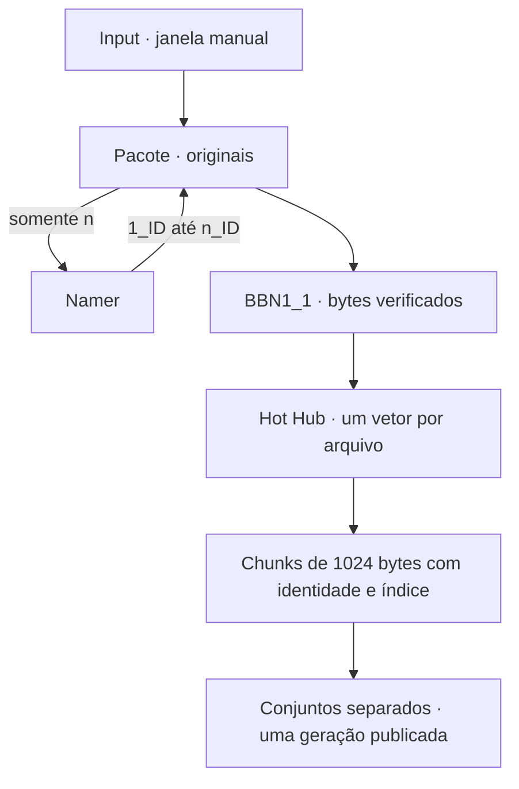

# AI MEMORY / Mimir

Ingestão local de qualquer arquivo regular em **um único formato de saída: conjuntos de chunks de bytes em JSON Lines (`.jsonl`)**. Cada arquivo produz um vetor ordenado de bytes e seu próprio conjunto de chunks de **1024 componentes inteiros entre 0 e 255**.

O Hot Hub processa exclusivamente os bytes do arquivo. PDF, áudio, vídeo, planilha, arquivo desconhecido ou arquivo com conteúdo inválido seguem exatamente o mesmo algoritmo. A extensão é somente um marcador para as etapas futuras.

## Fluxo implementado



1. `open` abre um ciclo. Cada envio por `add` é um arquivo distinto, mesmo se o conteúdo for igual.
2. `close` envia somente a quantidade `n` ao Namer. O Pacote recebe os stems `X_ID`, atribui-os aos arquivos e preserva a extensão original, inclusive maiúsculas.
3. O BBN1_1 requisita os arquivos ao Pacote e verifica os hashes de nome e conteúdo.
4. O Hot Hub lê **um arquivo por vez** em modo binário. Seu vetor contém todos os bytes, na ordem original, inclusive cabeçalhos, metadados e conteúdo comprimido.
5. O vetor é particionado em chunks; cada chunk recebe `marker`, `source_id`, `index` e `valid_length`. Cada arquivo tem seu próprio registro `.jsonl`.
6. O lote só é publicado após verificar todos os registros e reconstruir seus hashes. O BBN1_1 libera as cópias intermediárias somente após confirmar os chunks e o Pacote íntegros.

**Sorter, IDD, adaptadores, campos temporais, decodificação e derivados `.npy` não integram esta fase.** Os documentos arquiteturais anteriores e o histórico Git descrevem versões substituídas. O [contrato de bytes](docs/byte-chunks.md) é a especificação atual.

## Matemática e algoritmo único

Para um arquivo com `L` bytes:

\[
v=(b_0,\ldots,b_{L-1})\in\{0,\ldots,255\}^{L},\qquad m=\lceil L/1024\rceil.
\]

O chunk de índice `j`, começando em zero, tem `r_j = min(1024, L - 1024j)` bytes válidos. Seus 1024 componentes são:

\[
c_{j,k}=\begin{cases}b_{1024j+k},&k<r_j\\0,&r_j\le k<1024.\end{cases}
\]

O último bloco recebe zeros somente para completar o tamanho fixo. `valid_length = r_j` permite removê-los sem perder zeros que pertencem ao arquivo. A reconstrução concatena os prefixos válidos em ordem de índice e recupera exatamente `v`. Arquivo vazio tem vetor vazio e zero chunks; seu registro continua presente.

Este é o núcleo comum aos quatro exemplos e a qualquer outro formato; a implementação integral está em [`hub.py`](Transformer_Core/Hot_Hub/hub.py):

```python
from Transformer_Core.Hot_Hub.hub import byte_chunks, marker

with open(filename, "rb") as source:
    vector = source.read()  # bytes: um vetor imutável de inteiros uint8

for chunk in byte_chunks(vector, marker(canonical_name), source_id):
    publish(chunk)  # pseudocódigo: o Hot Hub grava cada objeto como uma linha JSON
```

`1_aB7.PDF` recebe o marcador `1_aB7/PDF`. Um arquivo sem extensão recebe `1_aB7/`, com extensão vazia. A barra faz parte de uma string de metadados, nunca do caminho de armazenamento. `source_id` combina a geração e o nome completo; o índice preserva a ordem e mantém chunks repetidos como ocorrências distintas.

## Demonstração: quatro formatos, uma saída

O gerador [`examples/hot_hub_four_formats.py`](examples/hot_hub_four_formats.py) cria um PDF textual de uma página, áudio WAV sintético de uma rua por cinco segundos, vídeo MKV sintético de uma estrada por cinco segundos e uma planilha XLSX 5×5. As dependências do gerador servem apenas para criar as entradas.

| Antes | Depois, pelo mesmo algoritmo |
| --- | --- |
| PDF de uma página | Bytes completos do PDF → vetor → chunks de 1024; marcador `X_ID/pdf` |
| Áudio WAV de 5 segundos | Bytes completos do WAV → vetor → chunks de 1024; marcador `X_ID/wav` |
| Vídeo MKV de 5 segundos | Bytes completos do MKV → vetor → chunks de 1024; marcador `X_ID/mkv` |
| Planilha XLSX de 5×5 células | Bytes completos do XLSX → vetor → chunks de 1024; marcador `X_ID/xlsx` |

O número de chunks é calculado a partir do tamanho real do arquivo, incluindo seu contêiner. Células, páginas, quadros e amostras de áudio não determinam fronteiras de chunks.

```python
import json
from pathlib import Path
from tempfile import TemporaryDirectory
from BN1_1.Pacote.cache import Pacote
from Transformer_Core.Hot_Hub.hub import HotHub
from examples.hot_hub_four_formats import create_examples

with TemporaryDirectory() as directory:
    base = Path(directory)
    sources = create_examples(base / "inputs")
    originals = {p.name: p.read_bytes() for p in sources}
    pacote = Pacote(base / "runtime")
    pacote.open()
    pacote.add(sources)
    pacote.close()
    hub = HotHub(base / "runtime")
    manifest = json.loads(hub.manifest.read_text())
    state = json.loads(pacote.state_file.read_text())
    for item in state["items"]:
        name = item["renamed"]
        restored = hub.reconstruct(name, manifest["sources"])
        assert restored == originals[item["name"]]
        print(item["name"], "→", len(restored), "bytes →",
              (len(restored) + 1023) // 1024, "chunks de 1024")
```

A demonstração verifica a reconstrução **byte a byte** dos quatro arquivos. Todo conteúdo usa o mesmo esquema. A interpretação semântica fica para uma etapa futura.

## Executar

Requer **Python 3.10+ em POSIX**, somente a biblioteca padrão para o pipeline:

```bash
python -m input open
python -m input add /caminho/documento.pdf /caminho/audio.wav
python -m input add /caminho/video.mkv /caminho/planilha.xlsx
python -m input close
python -m input status
```

`close` informa arquivos, bytes e chunks. `HUB_READY` significa que o conjunto completo foi publicado e verificado. Repetir `close` verifica o resultado; uma interrupção ou corrupção pode ser reparada a partir do Pacote íntegro, sem outro ID do Namer. A geração de armazenamento pode mudar na reparação.

Python mantém a comunicação direta com Pacote, Namer, BBN1_1 e CLI. `bytes` já fornece a representação compacta e exata de um vetor de bytes; não é necessário introduzir NumPy, FFI ou outro processo. JSON Lines permite que etapas escritas em outras linguagens consumam o mesmo contrato. Esta escolha prioriza integração e auditabilidade; não resulta de um benchmark entre linguagens.

## Armazenamento e compatibilidade

| Local no diretório de execução | Conteúdo |
| --- | --- |
| `cycle.json` | Estado do ciclo, nomes e resumo |
| `BN1_1/Pacote/files/<entrada>/<nome>` | Originais preservados |
| `BN1_1/Namer/` | Quantidade `n` e stems |
| `BN1_1/BBN1_1/<nome>` | Bytes intermediários; liberados após verificação |
| `Transformer_Core/Hot_Hub/generations/<geração>/<posição>.jsonl` | Um cabeçalho de arquivo seguido de seus chunks |
| `Transformer_Core/Hot_Hub/manifest.jsonl` | Uma linha JSON: geração ativa, inventário, hashes e resumo |

Todos os arquivos de saída do Hot Hub usam `.jsonl`. Não há cópias em PDF, WAV, MKV ou XLSX dentro do novo Hot Hub. Os originais continuam no Pacote. O manifesto associa o nome original renomeado ao registro e impede associação por mera posição ou por extensão.

- **Layout 3:** ciclos de versões anteriores são recusados sem migração nem exclusão. Use outro `MIMIR_RUNTIME_DIR` e reenvie os originais.
- Cada diretório de execução aceita um ciclo. A entrada pública mantém bloqueio exclusivo; chamadas diretas a `HotHub.build` devem ser serializadas pelo chamador.
- O vetor inteiro de um arquivo é carregado na memória, como definido nesta fase: memória `O(L + 1024)`. Arquivos maiores que a memória disponível precisam de uma futura extensão do contrato. A verificação percorre chunks individualmente.
- A serialização decimal JSON ocupa mais espaço que os bytes originais; não é compressão. Não há perda de precisão: cada componente é um inteiro de 0 a 255.
- Somente a geração indicada pelo manifesto está ativa. Gerações anteriores e gravações interrompidas podem permanecer; não há coleta automática nesta fase.
- O Pacote só poderá ser apagado em uma etapa futura de confirmação final. A limpeza atual do BBN1_1 não promete apagamento físico irrecuperável.

## Verificação

```bash
# Apenas para gerar PDF/WAV/MKV/XLSX usados na demonstração e nos testes:
python -m pip install -r requirements-demo.txt
python -m compileall -q input BN1_1 Transformer_Core examples tests
python -m unittest discover -s tests -v
```

A CI executa toda a suíte em Python 3.10 e 3.12. Os testes cobrem limites de 1024, todos os 256 valores de byte, arquivo e lote vazios, padding, repetição, separação de arquivos e lotes, corrupção, ordem, mistura, publicação interrompida, recuperação, CLI, concorrência, preservação de versões antigas e os quatro formatos reais de teste.
