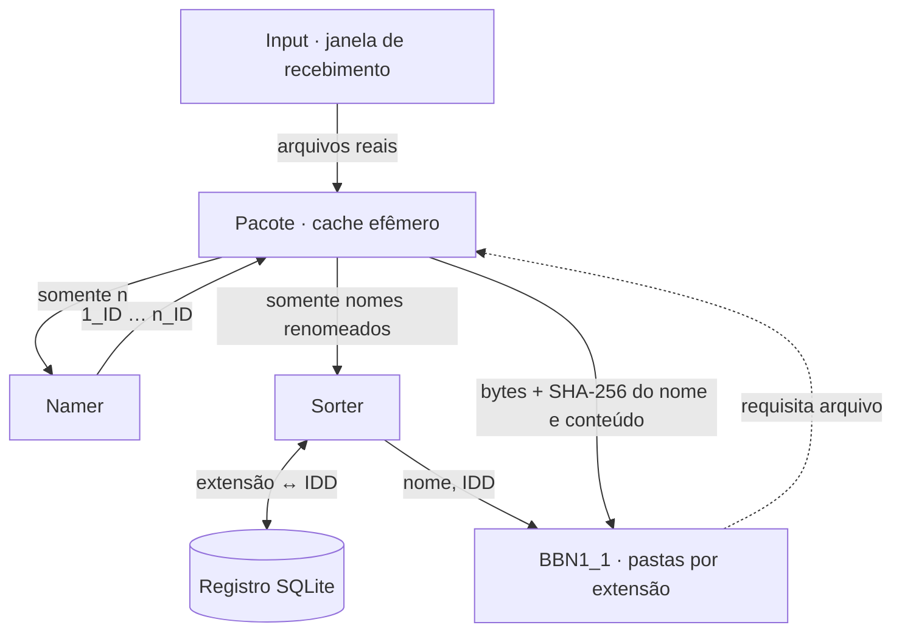

# AI MEMORY — Input e BN1_1

Implementação da primeira etapa do Mimir: receber um lote de arquivos, dar a cada arquivo um nome operacional temporário, classificar as extensões e guardar cópias verificadas no **BBN1_1**. Este README documenta apenas os componentes executáveis até essa fronteira.

## Arquitetura implementada



O **Input** é a porta de entrada externa. O **Pacote** pertence ao BN1_1 e mantém os arquivos reais. Namer e Sorter são componentes de controle: não recebem nem abrem os bytes. O BBN1_1 requisita os arquivos ao Pacote e verifica as cópias antes de guardá-las.

| Etapa | Entrada | Ação e saída |
| --- | --- | --- |
| Input → Pacote | Arquivos regulares de qualquer formato | Abre e fecha manualmente um lote; copia cada envio como entrada distinta. |
| Pacote → Namer | Apenas o inteiro `n` | O Namer gera um ID alfanumérico de três caracteres, usado uma vez no lote, e devolve `1_ID` até `n_ID`. |
| Namer → Pacote | Lista de stems | O Pacote sorteia uma bijeção, renomeia fisicamente os arquivos e preserva a extensão literal final. |
| Pacote → Sorter | Nomes como `1_aB7.pdf` | Extrai o token após o último ponto, com distinção entre maiúsculas e minúsculas; calcula `IDD = SHA-256(extensão em UTF-8)`. |
| Sorter → BBN1_1 | Pares `(nome, IDD)` | O BBN1_1 resolve a extensão no registro, requisita os bytes ao Pacote, verifica hashes e guarda a cópia na pasta dessa extensão. |

O IDD tem **64 caracteres hexadecimais**. Ele substitui o IDD de dois caracteres do desenho inicial: esta implementação segue a decisão posterior de usar SHA-256. Um hash não pode ser desfeito para recuperar a extensão. O registro SQLite conserva a relação `IDD ↔ extensão` e rejeita uma relação conflitante; o BBN1_1 só o consulta. Arquivos sem extensão usam o token vazio, cujo SHA-256 é uma classe própria. `pdf` e `PDF` permanecem distintos.

## Executar

Requer **Python 3.10+ em POSIX**. Usa somente a biblioteca padrão. Na raiz do repositório:

```bash
python -m input open
python -m input add /caminho/relatorio.pdf /caminho/imagem.PNG
python -m input add /caminho/arquivo-sem-extensao
python -m input status
python -m input close
```

`open` inicia a janela; `add` pode ser repetido enquanto ela está aberta. Cada envio conta uma entrada, inclusive dois envios do mesmo arquivo. `close` impede novos envios e executa todo o fluxo até o BBN1_1. Uma nova chamada a `close` retoma uma execução interrompida sem gerar outro ID nem refazer o sorteio. Um diretório de execução aceita um ciclo; use `MIMIR_RUNTIME_DIR` diferente para outro lote.

## Dados em execução

O código está organizado em `input/` (entrada pública) e `BN1_1/{Pacote,Namer,Sorter,BBN1_1}/` (componentes internos). Os dados são gerados fora das pastas de código e ignorados pelo Git:

```text
.mimir-runtime/                            # um ciclo; MIMIR_RUNTIME_DIR
├── cycle.json                            # estado e índice do Pacote
└── BN1_1/
    ├── Pacote/files/<entrada>/<nome renomeado>
    ├── Namer/inbox/n.json                 # somente {"n": ...}
    ├── Namer/outbox/stems.json
    ├── Sorter/partitions/<IDD>/names.json  # somente nomes
    └── BBN1_1/
        ├── by_extension/<extensão>/<nome renomeado>
        └── no_extension/<nome renomeado>

.mimir-state/extensions.sqlite3           # registro entre ciclos; MIMIR_REGISTRY_DB
```

SQLite foi escolhido para o registro durável porque fornece unicidade e transações sem dependências adicionais. Os arquivos reais continuam no sistema de arquivos: colocá-los como BLOBs no registro duplicaria o armazenamento e impediria a organização por pastas pedida para o BBN1_1. Os pequenos JSONs guardam o estado e as mensagens de **um ciclo**, enquanto o SQLite conserva extensões entre ciclos.

## Integridade e estado

- Um bloqueio de processo serializa `open`, `add` e `close`. Depois do fechamento, o lote não aceita alterações.
- O Pacote registra SHA-256 do conteúdo na entrada e confere novamente ao fornecê-lo. O BBN1_1 compara SHA-256 do nome completo e dos bytes recebidos antes de publicar a cópia.
- A associação arquivo ↔ stem é armazenada antes da renomeação, para permitir retomada após uma interrupção. Cópias incompletas e não indexadas de um `add` interrompido são descartadas enquanto a janela ainda está aberta.
- O registro de extensões distingue letras maiúsculas e minúsculas. SHA-256 é determinístico, mas não oferece reversão nem uma garantia matemática de ausência de colisões; conflitos detectados interrompem o fluxo.
- O estado final desta etapa é `STAGED`: o BBN1_1 possui as cópias verificadas. Os originais do Pacote continuam retidos; não há expiração ou limpeza automática definida.

## Regressões

```bash
python -m unittest discover -s tests -v
```

O mesmo comando roda no [workflow de CI](.github/workflows/ci.yml) em Python 3.10 e 3.12. Os testes cobrem concorrência, IDs estáveis, retomada, extensões com diferença de caixa, arquivos sem extensão, registro entre ciclos e detecção de alterações no cache.
