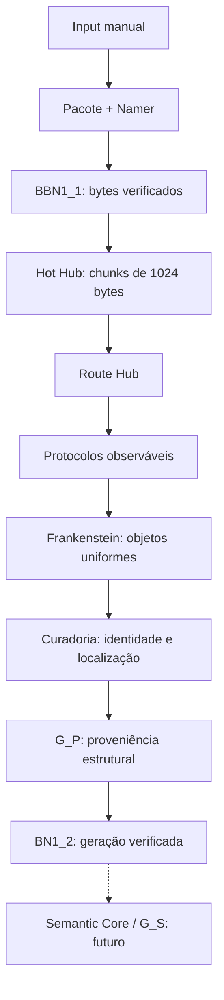
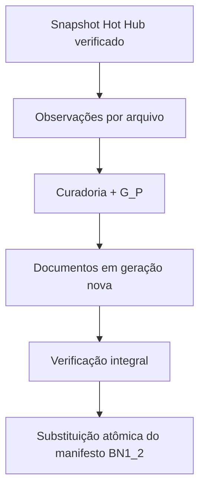

<div align="center">

# AI MEMORY / Mimir

### Ingestão verificável, decomposição estrutural e proveniência multimodal

[](https://github.com/Walc21/AI-MEMORY/actions/workflows/ci.yml)

[](https://github.com/Walc21/AI-MEMORY/releases/tag/v0.2.0)

**Bytes preservados → chunks verificáveis → objetos com origem, posição e sequência → BN1_2.**

</div>

> **Implementado na v0.2.0:** Input, Pacote, Namer, BBN1_1, Hot Hub, Route Hub, protocolos estruturais, Frankenstein, Curadoria/G_P e entrega verificada ao BN1_2. O pipeline termina na fronteira estrutural. Semantic Core/G_S permanece como próxima etapa.

## Fluxo executável



A atualização consome o **Hot Hub existente**, sem recolocar Sorter/IDD ou partições por extensão no BN1_1. O roteamento por formato ocorre depois da verificação dos bytes. `close` continua terminando em `HUB_READY`; `transform` avança até `BN1_2_READY` em um estado separado. Ciclos do layout 3 já concluídos podem ser transformados sem reenviar seus arquivos.

A [referência arquitetural fornecida, de 28/09/2026](docs/images/mimir-pipeline-2026-09-28.jpg) orienta esta etapa. Ela é um mapa conceitual: o contrato executável desta versão está descrito em [chunks de bytes](docs/byte-chunks.md) e [pipeline estrutural](docs/structural-pipeline.md).

## Instalação e uso

Requer **Python 3.10+ em POSIX**. Execute na raiz do repositório. A ingestão e os protocolos de texto, JSON, CSV, DOCX, XLSX e WAV PCM usam a biblioteca padrão. Para PDF, imagens e os demais formatos de áudio/vídeo:

```bash
python -m pip install -r requirements-structural.txt
```

Um fluxo completo:

```bash
export MIMIR_RUNTIME_DIR=/tmp/mimir-meu-ciclo
python -m input open
python -m input add /caminho/documento.pdf /caminho/audio.wav
python -m input add /caminho/video.mkv /caminho/planilha.xlsx
python -m input close
python -m input transform
python -m input verify
python -m input inspect
python -m input status
```

O diretório padrão é `.mimir-runtime`. Cada diretório aceita um ciclo; escolha outro `MIMIR_RUNTIME_DIR` para um novo lote. `transform` também conclui a ingestão se `close` ainda não foi chamado.

| Comando | Resultado |
| --- | --- |
| `open` | Abre a janela de entrada de um novo ciclo. |
| `add ARQUIVOS...` | Copia cada envio como entrada distinta, preservando os bytes. |
| `close` | Nomeia, verifica e publica chunks; libera o BBN1_1. |
| `transform` | Consome o Hot Hub e publica os objetos e G_P no BN1_2. |
| `transform --strict` | Exige extração completa de todos os arquivos, recusando resultados opacos. |
| `transform --force` | Produz outra geração mesmo que a anterior esteja íntegra e no mesmo perfil. |
| `verify` | Verifica Pacote, Hot Hub, vínculo entre gerações, documentos e G_P. |
| `inspect` | Lista origens canônicas, protocolos e contagens. |
| `inspect --source 1_aB7.pdf` | Mostra o documento estrutural completo da origem indicada. |
| `status` | Mostra o estado persistido de ingestão e transformação. Não substitui `verify`. |

`inspect` fornece os nomes canônicos reais; substitua `1_aB7.pdf` pelo nome do seu ciclo.

## Protocolos e fronteira semântica

| Rota | Observações publicadas | Dependência |
| --- | --- | --- |
| TXT, MD, LOG | Linhas UTF-8 e intervalos exatos de bytes. | stdlib |
| JSON | Objetos, arrays, valores e JSON Pointers; rejeita chaves duplicadas e números não finitos. | stdlib |
| CSV, TSV | Campos por linha lógica e intervalo de linhas físicas. | stdlib |
| DOCX | Parágrafos e tabelas do corpo principal; inventário e hashes da mídia embutida. | stdlib |
| XLSX | Planilhas, coordenadas, tipos, fórmulas e valores armazenados; não calcula fórmulas. | stdlib |
| PDF | Texto por página, dimensões e imagens XObject diretas por página. | pypdf |
| Imagem | Dimensões, modo e formato dos frames decodificados. | Pillow |
| WAV PCM | Canais, taxa, largura de amostra, contagem de amostras e duração racional. | stdlib |
| Áudio/vídeo | Streams, codecs, frames decodificados, PTS e base temporal. | PyAV |
| Extensão desconhecida | Raiz do arquivo com identidade e referência aos bytes, marcada como opaca. | stdlib |

A capitalização da extensão permanece no nome e no marcador; apenas o roteamento normaliza a extensão. A extensão **seleciona** o protocolo: conteúdo inválido não é apresentado como extração bem-sucedida.

O G_P publica exclusivamente `derived_from`, `contains` e `precedes`. A sequência representa a ordem de observação do protocolo dentro de cada grupo de irmãos. Isso não constitui leitura semântica ou associação entre assuntos de arquivos diferentes.

Não há OCR, transcrição, embeddings, busca semântica nem relações como “explica” ou “contradiz”. Imagens em DOCX possuem localização no arquivo ZIP, mas ainda não uma associação completa aos parágrafos onde são exibidas. PDFs têm localização por página e XObject, sem reconstrução completa do layout visual. O Semantic Core deverá consumir estas origens observáveis e acrescentar seu próprio contrato G_S.

## Contratos e publicação

O Hot Hub mantém o esquema **`mimir.byte-chunks.v1`**: um cabeçalho e chunks de 1024 inteiros entre 0 e 255, com `valid_length` para separar bytes reais do padding. O algoritmo mantém o arquivo inteiro em memória, preserva extensão e identidade, e permite reconstrução exata. O Pacote conserva os originais.

A nova etapa publica **`mimir.structural.v1`**, contendo:

- `source`: nome canônico, identidade da geração Hot Hub, tamanho e hashes dos bytes e do registro.
- `protocol`: rota, versão, dependências, estado e motivo de eventual saída opaca.
- `nodes`: objetos com ID determinístico, sequência, pai, localização e propriedades observadas.
- `provenance`: grafo G_P no esquema `mimir.provenance.v1`.

A identidade `source.id` inclui a geração do Hot Hub e o nome canônico. Arquivos com conteúdo igual permanecem distintos. IDs de objetos usam SHA-256 do objeto canônico, incluindo origem, posição, propriedades e pai.

O BN1_2 publica `mimir.bn1_2.v1`: um manifesto aponta arquivos JSON de uma geração completa. Cada arquivo representa uma origem. O manifesto contém hashes, resumo, perfil de limites/dependências e o vínculo ao manifesto Hot Hub verificado.



Uma falha antes da substituição não publica a geração parcial. A última geração publicada permanece disponível se ainda corresponder ao Hot Hub atual. `transform` reutiliza uma saída íntegra do mesmo perfil; corrupção ou mudança de perfil causa reconstrução a partir dos bytes verificados. Gerações antigas e tentativas incompletas podem permanecer no disco.

## Formatos opacos e limites

Por padrão, um formato desconhecido, parser indisponível, conteúdo inválido ou limite de extração alcançado produz um documento **opaco**, com a raiz do arquivo e um motivo explícito. Observações parciais são descartadas. Os bytes originais permanecem recuperáveis no Hot Hub. Use `--strict` para impedir a publicação de lotes com qualquer arquivo opaco.

O limite de tamanho do arquivo é aplicado antes da reconstrução em memória e **interrompe o lote**, inclusive no modo padrão.

| Limite padrão por arquivo | Valor |
| --- | --- |
| Bytes reconstruídos | 64 MiB |
| Objetos, incluindo raiz | 10.000 |
| Texto processado | 2.000.000 caracteres |
| Conteúdo ZIP expandido declarado | 128 MiB |
| Pixels por frame de imagem/vídeo | 25.000.000 |

```bash
python -m input transform --strict --max-file-bytes 33554432 --max-nodes 5000
```

A API Python aceita `Limits` para configurar todos os limites. Estes limites controlam o trabalho e a saída do protocolo; não representam um isolamento de memória/CPU dos parsers. Alguns decodificadores podem alocar recursos antes das verificações posteriores.

O pipeline ainda mantém um arquivo inteiro em memória, usa JSON para os bytes e não possui coleta automática de gerações ou remoção final de ciclos. SHA-256 detecta divergências contra o inventário esperado; não é uma assinatura contra alterações simultâneas em dados e hashes.

## Estrutura do runtime

```text
cycle.json                                  # layout 3 / estado da ingestão
BN1_1/Pacote/files/<entrada>/<nome>           # originais preservados
BN1_1/Namer/inbox/n.json                     # somente n
BN1_1/Namer/outbox/stems.json                # nomes temporários imutáveis
Transformer_Core/Hot_Hub/manifest.jsonl       # geração ativa de chunks
Transformer_Core/Hot_Hub/generations/<id>/    # registros .jsonl
Transformer_Core/Structural/state.json       # TRANSFORMING / FAILED / BN1_2_READY
BN1_2/manifest.json                          # entrega estrutural publicada
BN1_2/generations/<id>/<posição>.json         # objetos e G_P de cada origem
```

O BBN1_1 é temporário e já pode ter sido removido quando a nova transformação começa. A etapa estrutural utiliza o Hot Hub, não depende desse cache e não altera seu contrato. Runtimes anteriores ao layout 3 continuam recusados sem migração ou exclusão automática.

## Exemplo reproduzível e testes

```bash
python -m pip install -r requirements.txt -r requirements-demo.txt -r requirements-structural.txt
python -m examples.structural_pipeline
python -m compileall -q input BN1_1 BN1_2 Transformer_Core examples tests
python -m unittest discover -s tests -v
```

O exemplo cria PDF, WAV, MKV e XLSX sintéticos, executa o fluxo completo e verifica o resultado. Esses quatro arquivos geram **83 objetos, 235 relações de proveniência e zero saídas opacas**. Para manter a demonstração no disco, use `python -m examples.structural_pipeline --runtime /tmp/mimir-demo` com um diretório de ciclo novo.

A suíte preserva os 25 testes da ingestão e adiciona cobertura dos protocolos, identidade, proveniência, limites, CLI, concorrência, corrupção, vínculo entre gerações, interrupção de publicação e recuperação. A CI executa a suíte em Python 3.10 e 3.12.

Consulte os [contratos estruturais](docs/structural-pipeline.md), o [contrato de chunks](docs/byte-chunks.md) e o [changelog](CHANGELOG.md) para os detalhes da versão.
