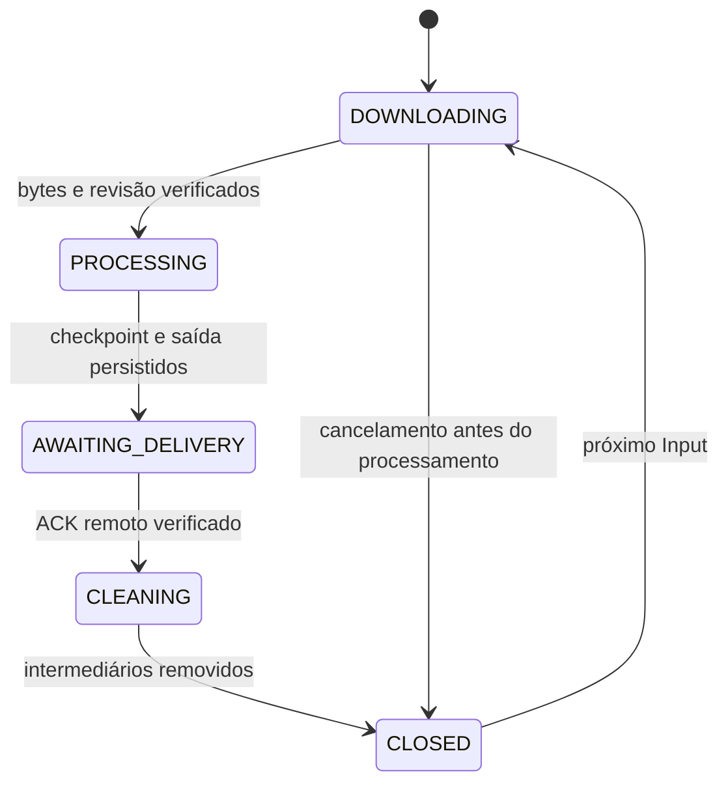

# Correções dos quatro contratos auditados — v0.5.1

Baseline: v0.5.0, `b9225d2c7f0830a2030e8f8cbcd98b74ed3a8b73`. Esta atualização corrige os quatro problemas reproduzidos na auditoria de 03/10/2026. O gate continua conservador: relata o suporte das fontes, e linguagem ou estruturas sem associação inequívoca podem se abster.

| Problema | Causa | Correção e aceite |
| --- | --- | --- |
| Identidade | Conjuntos de termos perdiam ordem/repetição do nome | Nome completo em sequência, partículas preservadas e aliases explícitos. Maria Clara não responde por Clara Maria; North South não prova South North. |
| Pertencimento | Objeto pai achatava identificadores de entidades vizinhas | Objetos com identidade própria são registros separados; pergunta exige identificador completo do registro. Alice recebe seu salário, Bob sua senha; perguntas cruzadas se abstêm. |
| Tempo | Um ano observado virava intervalo aberto de resposta | Cobertura temporal conferida contra a frase. Emprego relatado em 2020 responde sobre 2020 e se abstém sobre 2026; continuidade explícita e intervalos têm regras próprias. |
| Ciclo/privacidade | Locks por operação e só validação inicial das pastas | Um Input admitido por namespace até entrega verificada e limpeza; estado persistente, retomada de crashes, leitura de conta/pastas antes de cada upload e antes do ACK, flags explícitas obrigatórias. |

## Identidade, campos e evidência histórica

Similaridade continua recuperando candidatos. A prova exige o nome inteiro e ordenado, com fronteiras de palavras. A normalização conserva a política existente de caixa/acentos; não elimina partículas internas nem repetições. Overrides humanos continuam temporais e explícitos. Atributos de gramática desconhecida podem se abster.

Projeções `projection:record-v2` e `projection:field-v2:<hex>` conservam o escopo dos registros. JSON usa **JSON Pointer** para caminhos de campos: `/spec.serial` é a chave literal com ponto; `/spec/serial` é o caminho aninhado. Barra e til são escapados como `~1` e `~0`. Uma chave literal não sobrescreve outro caminho na projeção.

O identificador precisa estar na pergunta como valor completo. Uma palavra presente apenas em uma chave de ramo vizinho não identifica o sujeito. Objetos aninhados com nome/id próprios não são incorporados ao registro do pai; atributos sem identidade própria podem permanecer associados ao identificador explícito do seu registro. Arrays, arquivos, linhas e worksheets continuam separados. Estruturas ambíguas sem identificação suficiente se abstêm.

Evidências v1 permanecem imutáveis e verificáveis pelo decodificador histórico `views_v1.py`. Elas não são indexadas para uma nova resposta. O índice descartável passa à versão 3 e se reconstrói; originais, G_P, BN1_2 e ledger canônico permanecem preservados. Reflexões só entram no contexto factual quando sua íntegra é composta de unidades completas já selecionadas como evidência da resposta; dependências amplas de um episódio/registro não autorizam campos vizinhos.

## Cobertura temporal

- `João trabalhava na Acme em 2020.` sustenta o período observado em 2020. Não prova emprego em 2026.
- `Alice works at Acme in 2020-02-01.` sustenta a data observada, sem extrapolar para o dia seguinte.
- `Alice works at Acme since 2020.` declara continuidade. `João trabalhava ... desde 2020` conserva o limite do passado e não prova continuidade atual.
- Um intervalo explícito usa seus limites; fatos de nascimento conservam a semântica de evento registrada.
- `--history`, perguntas históricas sem data e buscas por palavras podem recuperar relatos passados, com sua quote visível. Isso não os transforma em estado atual.
- A consulta não reescreve intervalos/assertions antigos nem inventa uma data final. A restrição nova é uma decisão sobre suficiência temporal da fonte.

## Ciclo inteiro de Input

O contrato se aplica ao **namespace da memória**. Preparar um Pacote isolado não admite seus bytes no Semantic Core: Python/CLI/MCP também passam pelo mesmo lock de admissão e recusam outra ingestão quando o namespace aguarda entrega/limpeza.



`IO/input-cycle.json` é o journal autoritativo; `Input_Storage/jobs/<id>/cycle.json` conserva a conclusão por job. `COMPLETE` continua significando ingestão canônica confirmada; `DELIVERED` continua significando entrega do payload. **CLOSED** significa que os outputs vinculados ao ciclo foram confirmados e os intermediários locais foram removidos.

O sync entrega saídas pendentes antes de admitir outra entrada e entrega/fecha cada Input antes do próximo. Um lock de transferência impede dois sincronizadores no mesmo namespace. Outra ingestão Python/CLI/MCP é recusada durante o ciclo pendente, incluindo episódios de um harness; consultas permanecem disponíveis.

A limpeza remove apenas `source/`, `runtime/` e arquivos de staging vinculados ao job. Mantém recibos/journals, canon e originais no Drive. O canon é verificado antes da limpeza. `CLEANING` é persistido antes da remoção: interrupção nessa fase retoma a limpeza sem repetir inferência ou upload. Symlinks nos alvos de limpeza são recusados.

Jobs completos retidos da v0.5.0 são adotados e entregues/limpos em sequência. Recibos antigos DELIVERED sem comprovação de privacidade exigem readback do objeto já publicado, sem outro upload, antes de liberar a limpeza. Tentativas forçadas após CLOSED reconstroem somente os intermediários; falha de reprocessamento conserva o checkpoint anterior.

`io cancel-download <input_key>` / `io_cancel_download` libera exclusivamente uma reserva interrompida **antes** da admissão dos bytes. Ciclos em processamento ou já confirmados não podem ser cancelados por essa operação. Uma ingestão FAILED pode retomar sua própria revisão, conservando a exclusividade do Input.

## Privacidade e ponte MCP

Configuração e revalidação exigem `ownedByMe:true`, `shared:false` e `trashed:false` explícitos nas três pastas. Campos ausentes ou de tipo incorreto são recusados. A API relê conta e pastas antes de transferências e, para cada saída, antes de upload e antes do ACK; relê também o objeto remoto para tamanho/checksums e propriedade/privacidade.

Para a ponte do plugin:

1. Entregar/fechar o ciclo pendente antes de buscar outra entrada.
2. Chamar `io_begin_input(before)` antes de baixar; se `processed` estiver preenchido, reutilizar o recibo.
3. Revalidar conta/raiz/Entrada/Saída imediatamente antes de cada upload.
4. Fazer readback do arquivo e das pastas depois do upload.
5. Incluir em `remote_metadata` flags do arquivo e `folder_validation`, contendo `account_fingerprint`, `root`, `incoming`, `outgoing` com metadados observados. Então chamar `io_acknowledge`.

A ponte confia nos metadados que o host obteve do provedor; não concede OAuth nem acessa uma credencial oculta. A API faz essas leituras diretamente. Uma mudança externa simultânea não pode ser tornada atômica por este cliente: mudança detectada antes do upload impede a escrita; mudança detectada depois impede ACK/limpeza e deixa a entrega pendente para intervenção/reconciliação.

## Verificação e publicação

A suíte completa local passou com **194 testes**, sem skips. Os grupos do núcleo sem dependências totalizam 105 testes. Os testes de regressão conferem resultado, abstenção, claims/evidência/contexto, reinício, outbox, MCP real, dois processos, falha de entrega, interrupção antes do primeiro recibo e na limpeza, migração e privacidade antes/depois do upload. Os fixtures antigos que consultavam um relato pontual como atual foram ajustados para consultar seu período; os exemplos de abstenção no presente permanecem testes obrigatórios.

```bash
python -m unittest discover -s tests -v
python -S -m unittest discover -s tests -p test_audit_semantic_contracts.py -v
python -S -m unittest discover -s tests -p test_audit_input_cycles.py -v
# Depois de construir/instalar a wheel, fora do checkout:
python /caminho/do/checkout/tools/verify_release.py --expected-version 0.5.1
```

`verify_release.py` usa o pacote instalado e exige aceite dos quatro contratos. CI executa o gate e regressões em Python 3.10/3.12; o workflow de release o repete na wheel antes da publicação. O provedor Drive dessa validação é simulado; não há transferência de dados pessoais no aceite offline. Backup/restore integral, quotas globais e qualidade de modelos gerais continuam entregas independentes.
