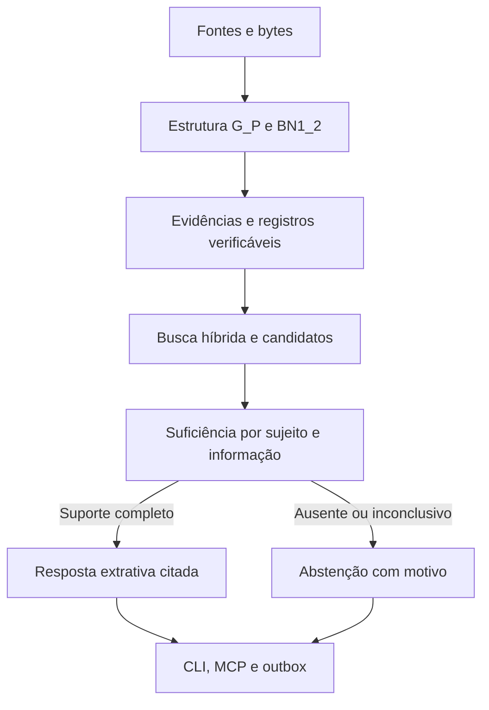

# Contrato de memória e resposta - v0.5.0

## Diagnóstico e alinhamento

Baseline: main/release v0.4.1, commit `b48606b6e083c0216745475c6c68a2d045380e19`. Fonte de requisitos: relatório integral de 02/10/2026, especialmente capítulos 12, 16, 17, 25, 28 e apêndice D. A suíte anterior tinha 144 testes verdes, mas não impedia respostas sobre um predicado diferente do solicitado.

| Achado | Correção desta release | Aceite |
| --- | --- | --- |
| F1: cor/nascimento devolviam emprego | Gate de sujeito, relação/campo e tipo de pergunta | Alice/Acme responde emprego e se abstém sobre cor/nascimento |
| F2: quote negativa aceitava claim positivo | Replay de gramática reconhecida na validação; prova independente na consulta | Polaridade/predicado/tempo incompatíveis recusados; claim opaco não responde relação |
| F9: colisão de hashing promovida a resposta | Similaridade somente gera candidatos | Caminho fixo do relatório não responde senha de satélite |
| Valores/células sem contexto | Projeções por registro/campo com componentes verificáveis | Valor de outra linha/registro/arquivo não é transferido |
| Resumos longos e duplicados/cortados | Consolidação extrativa limitada e deduplicada | Negação e unidades completas; dependências conservadas |
| F5: revisão externa antiga permanecia corrente | Filtro de revisão por identidade externa/tempo observado | Corrente, histórico e as-of distintos; originais preservados |

Bytes/chunks de 29/09 continuam sendo o contrato físico vigente. Não se alteram Hot Hub, Namer, G_P ou BN1_2 para corrigir significado. Os protocolos estruturais e o ledger permanecem compatíveis; índices descartáveis mudam para versão 2 e são reconstruídos automaticamente. A correção acrescenta projeções semânticas; não coloca interpretações no G_P.

## Fluxo de decisão



1. A recuperação preserva BM25, vetores, entidades, tempo e PPR; esses sinais não provam uma resposta.
2. Relações reconhecidas são revalidadas contra a frase original, incluindo objeto, polaridade e tempo. Uma negação responde à confirmação da proposição; não fornece um local/data positivo que a fonte negou.
3. Perguntas sobre um campo exigem o sujeito e o campo no mesmo registro ou atributo declarativo. A semelhança de nomes usa fronteiras de palavras; aliases requerem override explícito disponível no tempo consultado.
4. A única cadeia de dois saltos atualmente provada é emprego positivo + residência/localização da organização. PPR não justifica cadeias gerais.
5. `k` insuficiente para conservar uma cadeia/conflito provoca abstenção com motivo. `budget_chars` insuficiente para as unidades completas também provoca abstenção. Não se corta a fonte para fazer caber.
6. Resposta e contexto factual contêm apenas unidades selecionadas. Resumos conservam dependências e disponibilidade temporal; são derivados, nunca fontes independentes.

## Evidência estruturada

`projection:record-v1` reconstitui um registro; `projection:field-v1:<hex-da-chave>` reúne identificadores explícitos e um campo. O texto dessa projeção é uma serialização determinística dos objetos estruturais, **não uma quote literal do arquivo binário**. `structural_projection.components` expõe nós, localizadores e propriedades que permitem auditá-la, além do hash dos bytes originais. `resolve` recalcula a projeção antes de conferir seu span/hash. Alterar a quote sem alterar a fonte é recusado.

- JSON: objetos aninhados mantêm chaves qualificadas; arrays são fronteiras de registro; tipos numéricos/booleanos são preservados; null não é uma resposta conhecida.
- CSV/TSV e tabelas DOCX: convenção explícita de primeira linha como cabeçalho, somente quando rótulos são não vazios, distintos e não numéricos e a linha tem cardinalidade compatível. Sem esse contrato, somente valores brutos permanecem pesquisáveis.
- XLSX: cabeçalhos da primeira linha ocupada por worksheet, associação por coluna real, células esparsas, valores existentes. Não se executa fórmula. Um resultado armazenado é um cache da fonte, não uma recomputação verificada.
- TXT/Markdown/DOCX/PDF: frases mantêm offsets exatos, pontuação, decimais e unidades. Trechos vizinhos de outro sujeito/campo não são usados como resposta.
- PNG/OCR: observações derivadas conservam o método/coordenadas. Qualidade do OCR continua sendo um limite empírico da fonte observada.

## Interface e limites

| Campo | Significado |
| --- | --- |
| `abstained` | O sistema não compôs resposta factual suficiente |
| `answer` | Trechos citados ou mensagem de abstenção/conflito |
| `answer_evidence` | Citações efetivamente selecionadas para a resposta |
| `claims` | Relações verificadas e pertinentes, preservando reported/polaridade/tempo |
| `sufficiency` | Status, motivo e modo extrativo; pode indicar orçamento/k insuficientes |
| `hits` | Diagnóstico dos candidatos de busca; `supports_answer` indica suporte local antes dos limites globais |
| `context` | Evidência completa dentro do orçamento; resumos derivados disponíveis e Working Memory separada |

Um consumidor deve respeitar `abstained` e `answer_evidence`, em vez de tratar todo hit como prova. A memória afirma **o que as fontes relatam**; não verifica a verdade externa dos documentos. Gramática e vocabulário PT/EN são explícitos e conservadores. Correlação implícita, linguagem arbitrária, comparação, soma/média, pedidos exaustivos, inferência científica e prova matemática podem produzir abstenção. Modelos opcionais não eliminam esses limites.

Limites do pipeline continuam configuráveis e explícitos: padrão de 64 MiB/arquivo, 10.000 nós/arquivo, 2 milhões de caracteres/lote semântico, 20.000 assertions e 200.000 registros. Projeções contam nesse orçamento. A consulta ainda percorre vetores e verifica o histórico canônico; a suíte com 1.000 distratores não prova capacidade ilimitada ou desempenho no notebook do usuário.

Revisões externas são reconhecidas por `(provider, account_fingerprint, file_id)`, comparando `modified_time` e, em empate/ausência, momento da inferência. `--history` inclui todas; `--as-of` considera somente runs anteriores ao instante. Arquivos locais independentes não sofrem substituição automática por nome. Exclusão remota/tombstones não foi acrescentada.

O ciclo global de Input, limpeza após réplica externa, backup/restore integral, quotas globais, mudanças de privacidade remota e política geral de autoridade de agentes permanecem trabalhos separados do relatório. Esta release fecha o escopo de suficiência/recuperação testado; não declara todo o roteiro S0-S15 ou todos os cenários finais concluídos.

## Reproduzir o aceite

```bash
python -m pip install '.[structural,ocr,signing,mcp,drive,demo]'
# Linux: Tesseract eng e fonte DejaVu devem estar instalados.
python -m unittest discover -s tests -v
python -S -m unittest discover -s tests -p test_answer_grounding.py -v
python -m unittest discover -s tests -p test_memory_multiformat_acceptance.py -v
mimir eval
```

O teste multiformato gera nove arquivos reais, com informações independentes, e faz 11 consultas presentes + 8 ausentes no mesmo namespace. Ele verifica `answer`, `answer_evidence`, `abstained`, ausência de claims/contexto factual inventados, reinício, hashes/exportação dos originais e `verify`. PNG passa por Tesseract real. O teste de volume acrescenta 1, 40 e 1.000 registros distratores antes do alvo; o teste de projeção recusa corrupção; CLI/salvamento/outbox e MCP real compartilham a mesma decisão. ASR, Ollama e embeddings neurais reais não foram usados para afirmar qualidade geral.

O workflow de release publica wheel, ZIP portátil do plugin e SHA256SUMS somente após o sucesso de todos os jobs de CI no commit da mudança de versão. A wheel é instalada e exercitada fora do checkout antes da publicação. Isso vincula artefatos e release à revisão validada.
